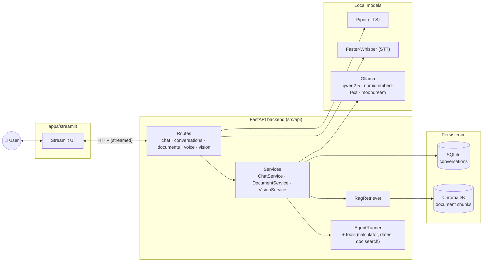

# Local AI Assistant


[](https://github.com/BhavanaBolishetty/local-ai-assistant/actions/workflows/ci.yml)
[](LICENSE)

A ChatGPT-style assistant that runs entirely on your own machine using a small
language model served by [Ollama](https://ollama.com) — no API keys, no cloud
calls, no data leaving your computer.

Built incrementally as a learning project covering the full stack of a
production-style AI application: layered backend architecture, RAG, tool use,
agentic reasoning, voice, and vision.

## Status: Phase 8 — Deployment ✅

Streamlit UI → FastAPI backend → Ollama → `qwen2.5:3b-instruct`, with
streaming responses, SQLite-backed conversation history, document upload
(ChromaDB + `nomic-embed-text`) for RAG, an agent (`src/agents/AgentRunner`)
that can chain up to 8 tool calls per turn with a visible step trace,
voice (Faster-Whisper speech-to-text, Piper text-to-speech), vision
(attach an image and ask about it, via `moondream`) — all fully local —
plus Docker Compose packaging, an integration test suite, and basic
request logging.

## Screenshots

| | |
|---|---|
|  |  |
| Unified ChatGPT-style input — text, image, and voice in one bar | Drag-and-drop documents into the RAG knowledge base |
|  |  |
| Live trace of each tool call the agent makes before answering | The completed reply, with a Play button for text-to-speech |
|  | |
| Past conversations persist across restarts and can be reopened or deleted | |

## Architecture



`OllamaClient` (`src/ai/`) is the only module that knows Ollama's wire
format; `VectorStore` (`src/rag/`) is the only one that knows Chroma's.
Domain objects (`src/models/`) flow between layers; each layer only imports
the one directly below it. `src/api/schemas/` is a separate, deliberately
thin layer that exists only to validate/serialize HTTP traffic.

## Folder structure

```
local-ai-assistant/
├── apps/streamlit/       # Streamlit frontend (talks to FastAPI only)
├── src/
│   ├── api/               # FastAPI app, routes, request/response schemas
│   ├── services/          # Business logic / orchestration (ChatService, DocumentService, VisionService)
│   ├── ai/                # Model client(s) — currently OllamaClient
│   ├── models/             # Framework-agnostic domain models (Message, Conversation)
│   ├── prompts/            # Prompt templates, loaded via src/utils/prompt_loader.py
│   ├── core/                # Config (pydantic-settings) and logging setup
│   ├── utils/                # Shared helpers
│   ├── repositories/         # ConversationRepository — persistence, abstracts SQLite away from services
│   ├── db/                    # SQLAlchemy async engine/session + ORM models
│   ├── memory/                 # (Later) context-window/summarization strategies
│   ├── rag/                     # chunker, VectorStore (Chroma), RagRetriever
│   ├── tools/                     # Tool (calculator, get_current_datetime, calculate_date_duration, search_documents) + ToolRegistry
│   ├── agents/                   # AgentRunner — the bounded, multi-step tool-calling loop
│   └── voice/                     # TranscriptionService (Faster-Whisper), SynthesisService (Piper)
├── data/                    # Gitignored runtime data: uploads, chroma/, sqlite/, whisper/, voices/, logs/
├── tests/
│   ├── unit/                 # Fast, no external services (Ollama/Chroma/etc. faked or skipped)
│   └── integration/           # Real FastAPI app + real SQLite/Chroma, fake OllamaClient
├── .env.example
├── Dockerfile
├── docker-compose.yml
└── pyproject.toml
```

## Installation

Requires Python 3.12+, [uv](https://docs.astral.sh/uv/), and
[Ollama](https://ollama.com) installed.

```bash
# 1. Install dependencies
uv sync

# 2. Pull the chat, embedding, and vision models
ollama pull qwen2.5:3b-instruct
ollama pull nomic-embed-text
ollama pull moondream

# 3. Copy environment config
cp .env.example .env
```

SQLite tables and the Chroma collection are created automatically at
backend startup (`data/sqlite/app.db`, `data/chroma/`) — no separate
migration step needed. The Whisper speech-to-text model and the Piper
voice are likewise fetched automatically on first backend startup
(`data/whisper/`, `data/voices/`) — the very first `uvicorn` launch will
take a bit longer while those download.

## Running

Two processes, two terminals:

```bash
# Terminal 1 — backend
uv run uvicorn src.api.main:app --reload --port 8000

# Terminal 2 — frontend
uv run streamlit run apps/streamlit/app.py
```

Open http://localhost:8501.

### Docker

```bash
docker compose up --build
```

Brings up the backend (`:8000`) and Streamlit frontend (`:8501`) in
containers — Ollama itself stays on the host (as it already does above);
the backend reaches it via `host.docker.internal`, so pull your models
there first, same as the non-Docker setup. `./data` is volume-mounted
into both containers, so conversations/documents/models persist across
rebuilds and are the same data your local (non-Docker) runs use.

## API reference

Full reference with example `curl` requests/responses for every
endpoint: [docs/API.md](docs/API.md). Interactive Swagger UI is also
auto-generated at `/docs` once the backend is running.

| Method | Path                       | Description                              |
|--------|----------------------------|--------------------------------------------|
| GET    | `/health`                  | Liveness check                            |
| POST   | `/chat`                    | Full conversation → complete reply + step trace |
| POST   | `/chat/stream`             | Full conversation → streamed NDJSON events  |
| GET    | `/conversations`           | List past conversations (id/title/created_at) |
| GET    | `/conversations/{id}`      | Load one conversation with its full message history |
| DELETE | `/conversations/{id}`      | Delete a conversation                     |
| POST   | `/documents`               | Upload a `.txt`/`.md`/`.pdf`/`.docx` file to the RAG knowledge base |
| GET    | `/documents`                | List uploaded documents (id/filename/chunk_count) |
| DELETE | `/documents/{id}`           | Delete a document and its chunks          |
| POST   | `/voice/transcribe`         | Audio file → `{"text": "..."}` (speech-to-text) |
| POST   | `/voice/speak`              | `{"text": "..."}` → raw WAV bytes (text-to-speech) |
| POST   | `/vision/ask`               | Image + text (multipart) → streamed answer about the image |

Request body for both `/chat` endpoints — the client still resends the full
message history each turn; `conversation_id` ties it to a persisted row
(auto-generated server-side if omitted):

```json
{
  "messages": [{"role": "user", "content": "Hello"}],
  "model": null,
  "conversation_id": null
}
```

`/chat` echoes `conversation_id` back in the JSON body, plus a `steps`
array (empty if the turn needed no tools) — one entry per resolved tool
call: `{"tool_name": "calculator", "arguments": {...}, "result": "..."}`.
`/chat/stream` returns `conversation_id` in an `X-Conversation-Id`
response header. Its body is NDJSON, one event per line — either
`{"type": "content", "text": "..."}` (a real streamed token chunk) or
`{"type": "step", "tool_name": ..., "arguments": ..., "result": ...}`
(one per resolved tool call, before the final answer streams in).

If any documents have been uploaded, every chat turn automatically embeds
the user's message, retrieves the most relevant chunks (cosine distance
below a threshold), and folds them into the system prompt — no separate
"RAG mode" to turn on. On top of that, `AgentRunner` lets the model
deliberately chain up to 8 tool calls in a single turn — e.g. searching
the documents, then computing something from what it found, then
checking the date — with each step exposed in the trace. True token
streaming is preserved for ordinary questions that need no tool at all.

Voice and image attachment are opt-in additions to the same chat input
bar (`st.chat_input(accept_audio=True, accept_file=True)`) rather than a
separate mode: recording a voice message transcribes it into the same
`prompt` a typed message would produce (so it flows through the exact
same send/RAG/agent pipeline above), and every assistant reply gets a
"🔊 Play" button that synthesizes and plays *that* message on demand —
nothing is auto-transcribed or auto-spoken.

Vision works differently on purpose: `moondream` (the vision model) has
no tool-calling support, so an image-attached turn is a separate,
simpler one-shot path (`VisionService`) rather than going through
`ChatService`/`AgentRunner`/`RagRetriever` — no RAG, no tools, just the
image and your question. The image itself is never persisted or resent;
follow-up questions in the same conversation go straight back through
the normal chat pipeline above, exactly as if no image had ever been
attached.

## Testing

```bash
uv run pytest
```

Runs both suites — `tests/unit/` (pure logic, individual components,
none of them touch a real external service) and `tests/integration/`
(the real FastAPI app end-to-end through every route, with a fake
`OllamaClient`/voice services standing in for Ollama/Whisper/Piper —
see `tests/integration/conftest.py`). Neither suite needs Ollama running
or any model pulled; both run in a few seconds.

## Logging

Console logging is always on (`LOG_LEVEL`, default `INFO`). Set
`LOG_FILE` (e.g. `./data/logs/app.log`) to also write a rotating log
file (5MB × 3 backups). Every request is logged with method, path,
status code, and duration.

## Roadmap

- [x] Phase 1 — Core chat loop (Streamlit + FastAPI + Ollama)
- [x] Phase 2 — Conversation memory (SQLite)
- [x] Phase 3 — RAG (ChromaDB, document upload)
- [x] Phase 4 — Tool calling
- [x] Phase 5 — Agent (planning, multi-step reasoning)
- [x] Phase 6 — Voice (Faster-Whisper, Piper)
- [x] Phase 7 — Vision
- [x] Phase 8 — Deployment (Docker, logging, testing)
