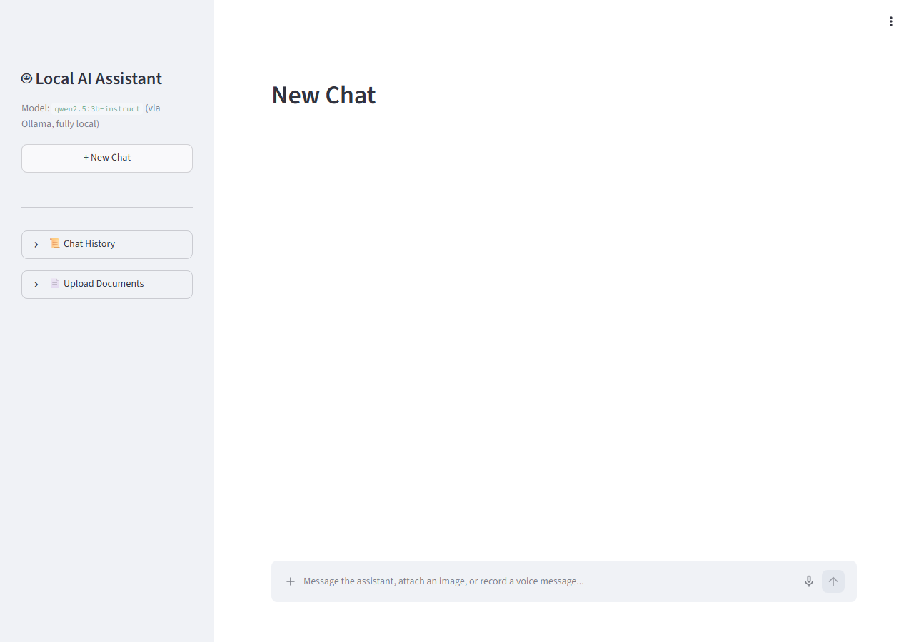
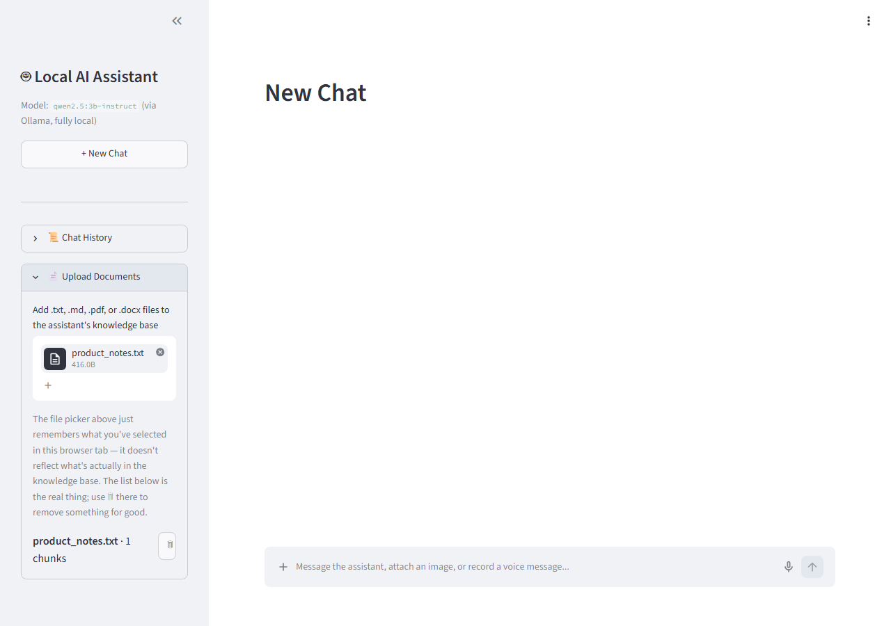
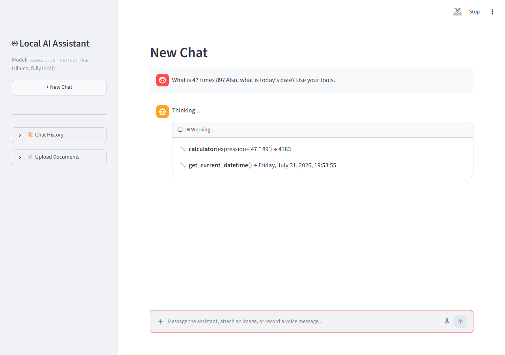
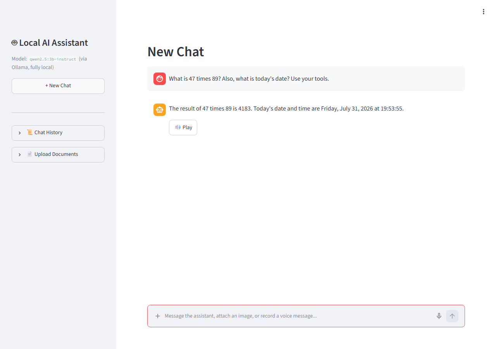
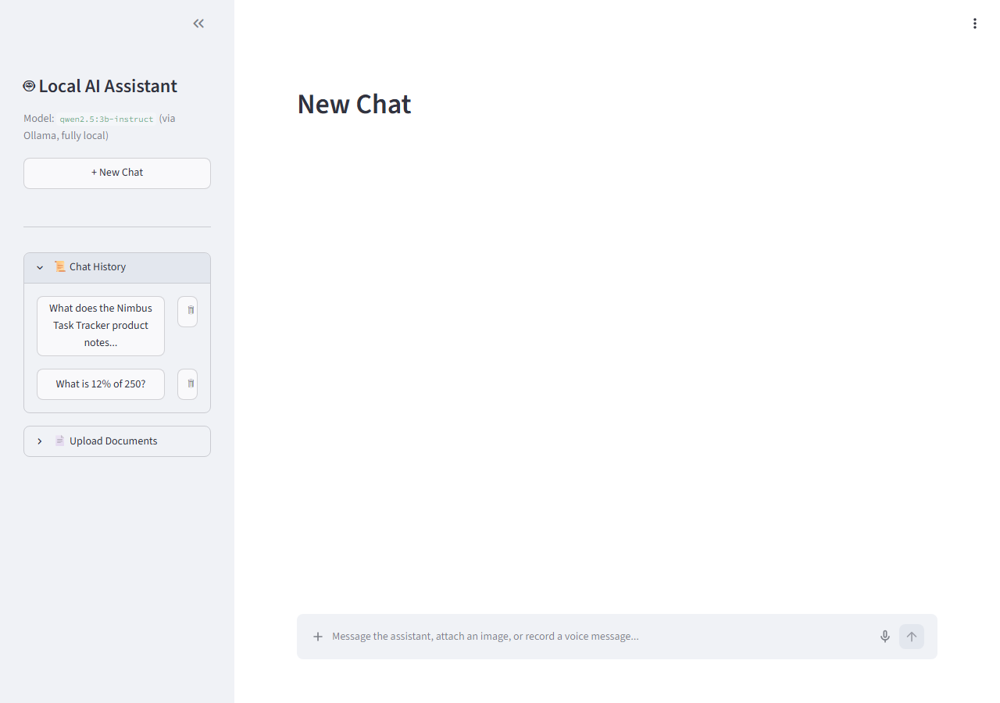

# 🧠 Local AI Assistant


[](https://github.com/BhavanaBolishetty/local-ai-assistant/actions/workflows/ci.yml)


A production-style **AI assistant** that runs **100% locally** using **Ollama** and open-source language models.

No OpenAI API. No cloud inference. No user data leaves your computer.

Built from scratch to learn how modern AI assistants work internally, including:

- 💬 Chat interface
- 🧠 Conversation memory
- 📄 RAG (Retrieval-Augmented Generation)
- 🛠 AI tool calling
- 🤖 Multi-step AI agent
- 🎤 Voice input & output
- 🖼 Vision (image understanding)
- 🐳 Docker deployment
- ✅ Unit & integration testing

---

# 🚀 Demo

### Chat



### Document Upload (RAG)



### Agent Tool Trace



### Answer + Voice Playback



### Chat History



---

# ✨ Features

## 💬 Chat

- ChatGPT-style interface
- Streaming responses
- Persistent conversation history
- Markdown rendering

---

## 🧠 Conversation Memory

- SQLite-backed chat history
- Resume previous conversations
- Delete conversations
- Automatic conversation titles

---

## 📄 Retrieval-Augmented Generation (RAG)

Upload documents including:

- TXT
- Markdown
- PDF
- DOCX

The assistant automatically:

- Chunks documents
- Creates embeddings
- Stores them in ChromaDB
- Retrieves relevant information
- Injects context into the prompt

No manual "RAG mode" required.

---

## 🤖 AI Agent

The assistant can perform multi-step reasoning using tools such as:

- Calculator
- Current date & time
- Date duration calculator
- Document search

Every tool call is displayed as a live reasoning trace.

---

## 🎤 Voice

- Speech-to-text using Faster Whisper
- Text-to-speech using Piper
- Record voice directly from the chat interface
- Play assistant responses

---

## 🖼 Vision

Upload an image and ask questions such as:

- Describe this image
- What text is written?
- Explain this diagram

Powered by **Moondream**.

---

## 🐳 Docker Support

Run the entire application with Docker Compose.

Backend and frontend are containerized while Ollama runs on the host machine.

---

## ✅ Testing

Includes

- Unit Tests
- Integration Tests

Current test suite:

```
58 tests passing
```

---

# 🏗 Architecture

```
                Streamlit UI
                     │
                     ▼
                FastAPI Backend
                     │
        ┌────────────┼────────────┐
        ▼            ▼            ▼
   ChatService  DocumentService VisionService
        │            │
        │            ▼
        │      RagRetriever
        │            │
        ▼            ▼
 ConversationRepo  ChromaDB
        │
        ▼
     SQLite
        │
        ▼
   OllamaClient
        │
 ┌──────┼───────────┐
 ▼      ▼           ▼
Qwen  Nomic Embed  Moondream
```

---

# 🛠 Tech Stack

## Frontend

- Streamlit

## Backend

- FastAPI
- Pydantic
- HTTPX

## AI

- Ollama
- Qwen2.5
- Nomic Embed
- Moondream

## Voice

- Faster Whisper
- Piper

## Database

- SQLite
- SQLAlchemy
- ChromaDB

## Testing

- Pytest

## DevOps

- Docker
- Docker Compose
- GitHub Actions

---

# 📁 Project Structure

```
local-ai-assistant/

apps/
    streamlit/

src/
    api/
    ai/
    agents/
    core/
    db/
    memory/
    models/
    prompts/
    rag/
    repositories/
    services/
    tools/
    utils/
    voice/

tests/
    unit/
    integration/

data/
    chroma/
    sqlite/
    uploads/
    whisper/
    voices/
    logs/

docs/
    API.md
    images/

Dockerfile
docker-compose.yml
pyproject.toml
README.md
```

---

# ⚙ Installation

## Clone the repository

```bash
git clone https://github.com/BhavanaBolishetty/local-ai-assistant.git

cd local-ai-assistant
```

## Install dependencies

```bash
uv sync
```

## Pull required models

```bash
ollama pull qwen2.5:3b-instruct

ollama pull nomic-embed-text

ollama pull moondream
```

## Create environment file

```bash
cp .env.example .env
```

---

# ▶ Running Locally

Backend

```bash
uv run uvicorn src.api.main:app --reload --port 8000
```

Frontend

```bash
uv run streamlit run apps/streamlit/app.py
```

Open

```
http://localhost:8501
```

---

# 🐳 Running with Docker

```bash
docker compose up --build
```

Ollama itself stays on the host machine — the backend reaches it via
`host.docker.internal`, so pull your models there first, same as the
non-Docker setup above. `./data` is volume-mounted into both containers,
so conversations/documents/models persist across rebuilds.

Open

```
http://localhost:8501
```

---

# 📚 API Documentation

Interactive Swagger documentation:

```
http://localhost:8000/docs
```

Detailed API documentation:

```
docs/API.md
```

---

# 🧪 Testing

Run all tests

```bash
uv run pytest
```

Includes:

- Unit Tests
- Integration Tests

---

# 📝 Logging

Console logging is enabled by default.

Optional rotating log files can be enabled by setting:

```env
LOG_FILE=./data/logs/app.log
```

Each request records:

- Method
- Path
- Status Code
- Duration

---

# 🎯 Why I Built This

I built this project to understand how modern AI assistants work end-to-end without relying on proprietary cloud APIs or high-level frameworks.

Instead of using frameworks like LangChain, I implemented the core concepts directly, including:

- Conversation memory
- Retrieval-Augmented Generation (RAG)
- Tool calling
- Multi-step agent workflows
- Speech recognition
- Text-to-speech
- Vision
- Docker deployment
- Automated testing

This project demonstrates how to build a production-style AI application using clean architecture, asynchronous FastAPI services, and locally hosted open-source models.

---

# 🚀 Future Improvements

Possible future enhancements include:

- Cloud deployment
- Authentication
- Multi-user support
- GPU optimization
- Additional tools
- Model switching
- Mobile-friendly UI

---

# 📄 License

This project is licensed under the MIT License.

---

# 👩‍💻 Author

**Bhavana Bolishetty**

GitHub: https://github.com/BhavanaBolishetty
